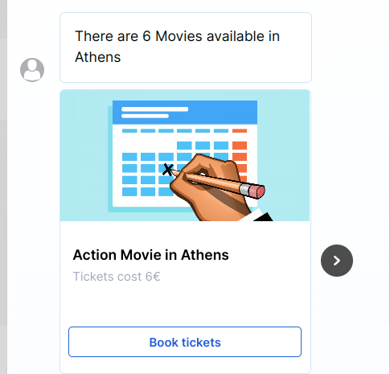
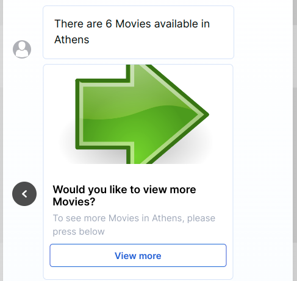
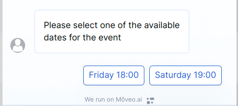

# Webhooks used in **Book tickets** brain template

For general information about using webhooks in Moveo you can check our [documentation](https://docs.moveo.ai/docs/get_started/webhooks)

`get-events` [/api/book-tickets/get-events](#route-1-apibook-ticketsget-events)

`get-event-dates` [/api/book-tickets/get-event-dates](#route-2-apibook-ticketsget-event-dates)

`calculate-total-cost` [/api/book-tickets/calculate-total-cost](#route-3-apibook-ticketscalculate-total-cost)

## Route 1: /api/book-tickets/get-events

This is a POST endpoint that you can call like this:

```sh
curl -X POST -H "Content-Type: application/json" -H "X-Signature: <YOUR_SIGNATURE>" -d '{ "lang": "en", "context": {"event_type_value": "Movies", "area": "New York"}}' "https://integration-guides.moveo.ai/api/book-tickets/get-events"
```

It returns a **carousel** with available events for a _category_ and _area_.

### Quick overview of the code:

1. Validate request
2. Extract context variables from the request body
3. Check for missing parameters
4. Extract page. When `page_number` is negative we return a [text response]().
5. Get the data from dummy endpoint
6. Create and return a carousel using the data

### Parameters (context variables)

| Name             | Required | Type   | Description                                                                                                                                                             |
| ---------------- | -------- | ------ | ----------------------------------------------------------------------------------------------------------------------------------------------------------------------- |
| event_type_value | required | string | The type of the events. <br /> <br /> Supported values: `Concerts`, `Festivals`, `Theatrical performances`, `Musical shows`, `Dance performances`, `Cartoons`, `Movies` |
| area             | required | string | The area where the events will be held. <br /> <br /> Supported values: `New York`, `London`                                                                            |
| page_number      | optional | number | An integer that is used for pagination. Negative value indicates the end of the results.                                                                                |

### Responses

There are 4 possible scenarios of the webhook completing successfully:

1. The `page_number` is missing from the context (should be the first time the webhook is called) and the search has results:

   - we return a [text response](https://docs.moveo.ai/docs/get_started/response_text) informing the user for the number of the results.
   - then we return a [carousel](https://docs.moveo.ai/docs/get_started/response_carousel)

2. In all subsequent calls for more results:
   - we return only a carousel
3. There are no results from the search:
   - we return a text response to inform the user.
4. The `page_number` is negative:
   - we return a text response informing the user that there are no more results

When creating the carousel if there are more than 5 results left to show, the carousel has 5 [event](#event-card) cards and one [view more](#view-more-card) card. Otherwise it contains only `event cards`.

#### Event card



#### View more card



## Route 2: /api/book-tickets/get-event-dates

This is a POST endpoint that you can call like this:

```sh
curl -X POST -H "Content-Type: application/json" -H "X-Signature: <YOUR_SIGNATURE>" -d '{ "lang": "en", "context": {"event_id": "5878857406"}}' "https://integration-guides.moveo.ai/api/book-tickets/get-event-dates"
```

It returns a **text response** with **options** consisting of the available dates for a specific event.



### Quick overview of the code:

1. Validate request
2. Extract context variables from the request body
3. Check for missing parameters
4. Get the dates from a dummy endpoint
5. Create and return a text response using the dates

### Parameters (context variables)

| Name     | Required | Type   | Description                   |
| -------- | -------- | ------ | ----------------------------- |
| event_id | required | number | The 10-digit id of the event. |

## Route 3: /api/book-tickets/calculate-total-cost

This is a POST endpoint that you can call like this:

```sh
curl -X POST -H "Content-Type: application/json" -H "X-Signature: <YOUR_SIGNATURE>" -d '{ "lang": "en", "context": {"event_id": "5878857406"}}' "https://integration-guides.moveo.ai/api/book-tickets/get-event-dates"
```

It does a simple calculation and adds the `total_cost` variable to the context of the dialog.

### Quick overview of the code:

1. Validate request
2. Extract context variables from the request body
3. Check for missing parameters
4. Return and add `total_cost` variable to context

### Parameters (context variables)

| Name           | Required | Type   | Description                   |
| -------------- | -------- | ------ | ----------------------------- |
| tickets_amount | required | number | The amount of tickets to book |
| price          | required | number | The price of each ticket      |
