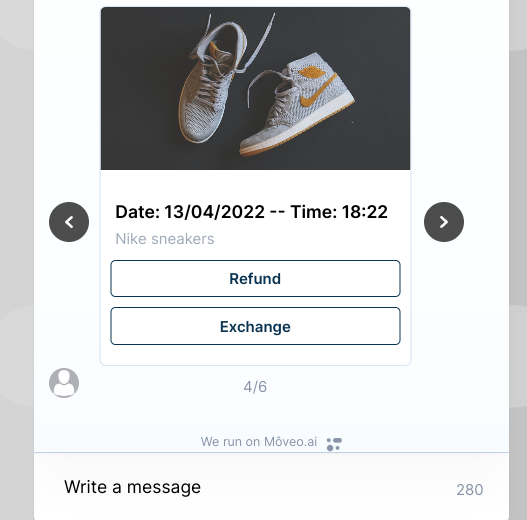
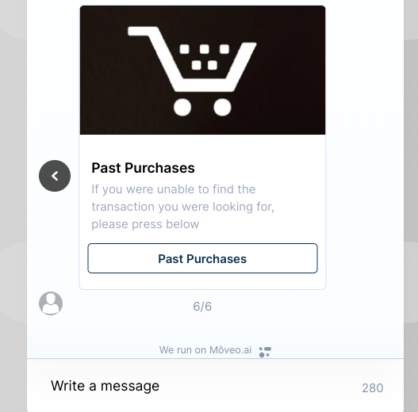

# Webhooks used in **Return & exchange requests** brain template

For general information about using webhooks in Moveo you can check our [documentation](https://docs.moveo.ai/docs/get_started/webhooks)

`purchases-get-recent` [/api/ecommerce/purchases-get-recent](#route-1-apiecommercepurchases-get-recent)

## Route 1: /api/ecommerce/purchases-get-recent

This is a POST endpoint that you can call like this:

```sh
curl -X POST -H "Content-Type: application/json" -H "X-Signature: <YOUR_SIGNATURE>" -d '{ "lang": "en", "context": {}}' "https://integration-guides.moveo.ai/api/ecommerce/purchases-get-recent"
```

It returns a [**carousel**](https://docs.moveo.ai/docs/get_started/response_carousel) consisting of dummy past purchases of the user.

### Quick overview of the code:

1. Validate request
2. Get purchases type from query parameter `isClothes` (if it's false we show tech purchases instead)
3. Get the data from dummy endpoint
4. Create and return a carousel using the data

### Parameters (context variables)

Context variales: `purchase_cursor` used on subsequent calls of the webhook to get the next results.

Query parameter: `isClothes` used to get different type of purchases (clothing and tech)

### Responses

- If `purchase_cursor` is not present it returns a carousel with 6 cards. The first 5 cards are `purchase cards` and the last one is a `past purchases` card (images below).

#### Purchase card



#### Past purchases card


